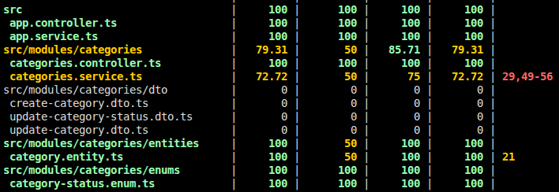

# Categories Module (`CategoriesModule`)

The **Categories** module is part of the backend system developed with **NestJS**, **TypeScript**, and **TypeORM** (PostgreSQL). Its main goal is to allow the creation, query, update, and status management of menu categories, ensuring compliance with business rules such as name uniqueness and status control for consumption in public menus and products.

---

## Technologies & Tools

* **Framework:** NestJS
* **ORM:** TypeORM
* **Database:** PostgreSQL (`UUID` format for IDs)
* **Validation:** `class-validator`, `class-transformer`
* **Documentation:** `@nestjs/swagger`
* **Testing:** Vitest / Jest (`@nestjs/testing`)

---

## Implemented Business Rules

* **`RN-021` (Name Uniqueness):** The name of a category must be unique in the system. It is validated during both creation and update operations. If it already exists, it returns a `409 Conflict` error.
* **`RN-022` (Initial Status):** Every new category is automatically registered with the `ACTIVE` status. The creation payload does not allow setting or modifying the status.
* **`RN-023` (Public Menu Filter):** For the public menu view (`HU-005`), the module exposes the `findAllActive()` method, which returns only categories with an `ACTIVE` status.
* **`RN-024` (Allowed Statuses):** The only allowed statuses in the system are `ACTIVE` and `INACTIVE`, defined via the `CategoryStatus` enum.

---

## Module Structure

```text
src/modules/categories/
├── dto/
│   ├── create-category.dto.ts          # Validation for category creation
│   ├── update-category.dto.ts          # Validation for partial updates
│   └── update-category-status.dto.ts   # Validation for changing status (ACTIVE/INACTIVE)
├── entities/
│   └── category.entity.ts              # TypeORM data model using UUID
├── enums/
│   └── category-status.enum.ts         # Enum defining allowed statuses
├── categories.controller.ts            # HTTP routing and Swagger documentation
├── categories.controller.spec.ts       # Controller unit tests
├── categories.service.ts               # Business logic and repositories
├── categories.service.spec.ts          # Service unit tests
└── categories.module.ts                # Module configuration and exports
```

---

## API Endpoints (`/categories`)

| Method | Endpoint | Description | HTTP Responses |
| :--- | :--- | :--- | :--- |
| `POST` | `/categories` | Creates a new category (Initial status: `ACTIVE`) | `201 Created`<br>`400 Bad Request`<br>`409 Conflict` |
| `GET` | `/categories` | Lists all categories | `200 OK` |
| `GET` | `/categories/:id` | Retrieves category details by `UUID` | `200 OK`<br>`404 Not Found` |
| `PATCH` | `/categories/:id` | Updates name or description of a category | `200 OK`<br>`404 Not Found`<br>`409 Conflict` |
| `PATCH` | `/categories/:id/status` | Activates or inactivates a category (`ACTIVE` / `INACTIVE`) | `200 OK`<br>`400 Bad Request`<br>`404 Not Found` |

---

## Sample Payloads (JSON)

### 1. Create a Category (`POST /categories`)
```json
{
  "name": "Drinks",
  "description": "Soft drinks and juices"
}
```

### 2. Change Status (`PATCH /categories/:id/status`)
```json
{
  "status": "INACTIVE"
}
```

---

## Integration with Other Modules

The `CategoriesService` is exported from `CategoriesModule` for reusability:
* **HU-004 (Products):** Allows verifying the existence and validity of categories associated with products.
* **HU-005 (Public Menu):** Consumes `findAllActive()` to render only active categories on the frontend.

---

## Unit Testing Coverage

The module includes integrated automated tests. Below is the official test coverage report generated from running the module tests:

### Coverage Report Summary



To rerun the tests and generate this coverage report in the console:

```bash
# Run unit tests for the categories module
npm run test src/modules/categories

# Generate coverage report
npm run test:cov
```

---

# Created By

* Cesar Vega Morales